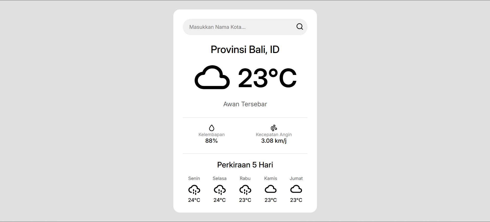

# Proyek Aplikasi Cuaca Sederhana 🌦️

Sebuah proyek aplikasi cuaca sederhana yang dibuat menggunakan HTML, CSS, dan JavaScript murni. Proyek ini bertujuan untuk melatih fundamental pengembangan frontend, terutama dalam manipulasi DOM dan integrasi dengan API eksternal.





## Fitur Utama

* **Pencarian Berbasis Kota:** Menampilkan data cuaca dari berbagai kota di dunia.
* **Informasi Cuaca Detail:** Menyajikan suhu, kondisi, kelembapan, dan kecepatan angin.
* **Ramalan 5 Hari:** Memberikan tampilan perkiraan cuaca untuk lima hari mendatang.
* **Ikon Dinamis:** Ikon cuaca berubah secara otomatis sesuai dengan data yang diterima.

## Teknologi yang Digunakan

* **HTML5:** Sebagai kerangka utama aplikasi.
* **CSS3:** Untuk styling dan layout, dengan implementasi Flexbox.
* **JavaScript (Vanilla):** Sebagai mesin utama untuk logika, interaksi, dan pemanggilan API.
* **[OpenWeatherMap API](https://openweathermap.org/api):** Sebagai penyedia data cuaca.
* **[Tabler Icons](https://tabler.io/icons):** Sebagai sumber ikon yang digunakan dalam aplikasi.

## Panduan Instalasi Lokal

Untuk menjalankan proyek ini di komputermu:

1.  **Clone Repositori:**
    ```bash
    git clone [https://github.com/namapengguna/nama-repo.git](https://github.com/namapengguna/nama-repo.git)
    ```

2.  **Dapatkan API Key:**
    Buat sebuah API key gratis melalui website [OpenWeatherMap](https://openweathermap.org/api).

3.  **Buat File Konfigurasi:**
    Di dalam direktori utama proyek, buat sebuah file baru bernama `config.js`.

4.  **Masukkan API Key:**
    Isi file `config.js` dengan format berikut:
    ```javascript
    const apiKey = 'MASUKKAN_API_KEY_KAMU_DI_SINI';
    ```

5.  **Buka Aplikasi:**
    Jalankan file `index.html` menggunakan browser.

## Kredit

Terima kasih kepada **OpenWeatherMap** atas penyediaan API cuaca gratis dan **Tabler Icons** untuk koleksi ikon yang luar biasa.
